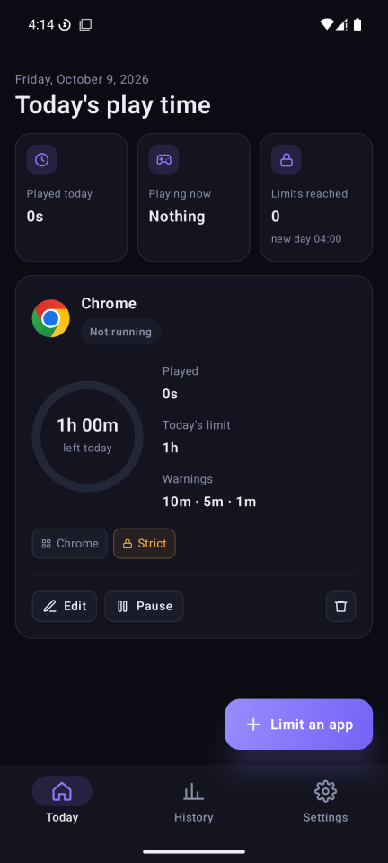
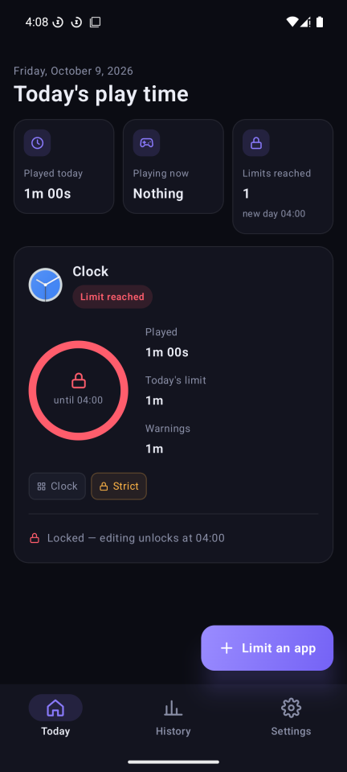
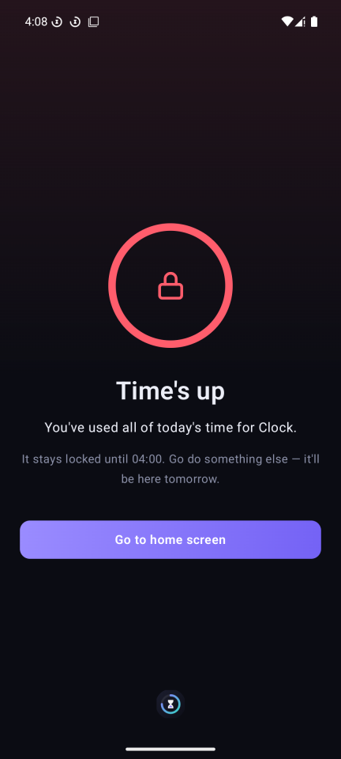
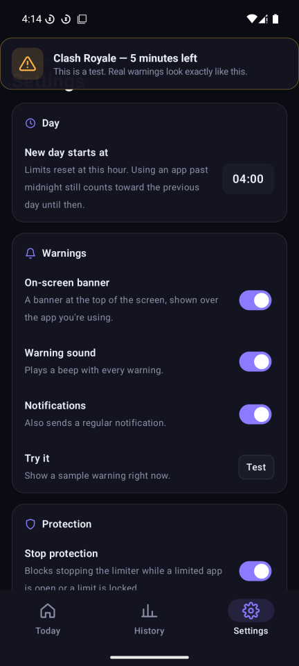
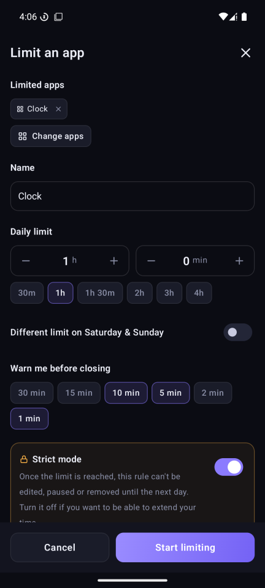
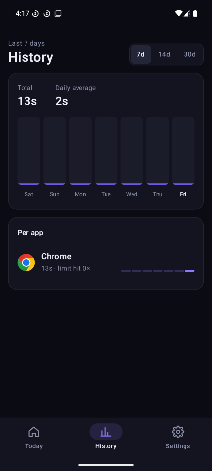

# Game Time Limiter — Android

Daily time limits for any game or app on your Android phone. Native Kotlin + Jetpack Compose.

## Download

Get the latest `.apk` from the [Releases](../../releases/latest) page and open it on your phone (Android 8 or newer). Android will ask you to allow installing apps from your browser or file manager.

| Today | Limit reached | Time's up |
| --- | --- | --- |
|  |  |  |

| Warning | Adding an app | History |
| --- | --- | --- |
|  |  |  |

## How it works

- **Limit any app.** Pick one or more installed apps for each limit (your most-used apps are listed first). Several limits can run at once, each with its own budget.
- **Counts real screen time.** Time only counts while one of the apps is on screen and the screen is on.
- **Warnings before closing.** A banner at the top of the screen, a beep and a notification at the warning points you choose (default: 10, 5 and 1 minutes left).
- **Locks it until tomorrow.** When the limit is reached, a full-screen "Time's up" page covers the app and it's closed. Opening it again brings the lock screen back until the next day.
- **Extra time after the limit (per app).** After time's up you can come back for 5, then 2, then 1 more minute, with a 5-minute cooldown between each, to finish what you were doing. Then it's locked for the day.
- **Your own warning sound.** Pick any audio file in Settings (the first 10 seconds are played), or keep the built-in beep.
- **Strict mode (per app).** Once the limit is reached the rule can't be edited, paused or removed until the next day.
- **New day at 04:00 by default** (configurable), so using an app past midnight doesn't reset your limit.
- Weekend limits, a 7/14/30-day history, and a 0-minute limit to block an app completely.

### Permissions

On first launch the app asks for:

| Permission | Why |
| --- | --- |
| Usage access (required) | See which app is on screen. Nothing leaves the phone. |
| Display over other apps (required) | Show the warning banner and the lock screen. |
| Notifications | Warning notifications. |
| Unrestricted battery | Stops Android from putting the limiter to sleep. |

The limiter runs as a background service with a small persistent notification and restarts after a reboot.

### Hard to bypass, not impossible

- Stop protection refuses to stop the limiter while a limited app is open or locked.
- Moving the phone clock forward while the limiter runs, or backward at any time, is ignored.
- Someone determined can still force-stop the app, revoke its permissions or uninstall it from Android's settings.
- Android doesn't let one app fully kill another, so the limited app is covered by the lock screen and closed when it's in the background.

iOS isn't supported. Apple only allows this kind of app through its Screen Time API, which needs a special entitlement from Apple.

## Development

Requirements: JDK 17+ and the Android SDK (platform 35). Android Studio has both.

```sh
./gradlew assembleDebug      # app/build/outputs/apk/debug/app-debug.apk
./gradlew assembleRelease    # app/build/outputs/apk/release/app-release.apk
```

Release signing reads `keystore.properties` from the project root (not committed):

```properties
storeFile=release.keystore
storePassword=...
keyAlias=gtl
keyPassword=...
```

Keep a backup of `release.keystore` and its password. Updates to an installed app must be signed with the same key.
